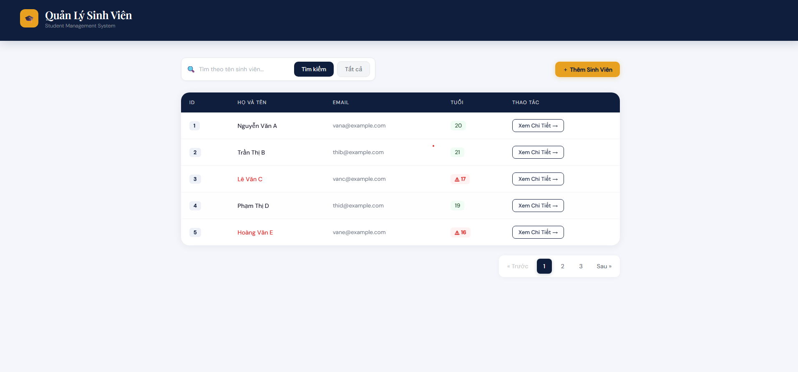
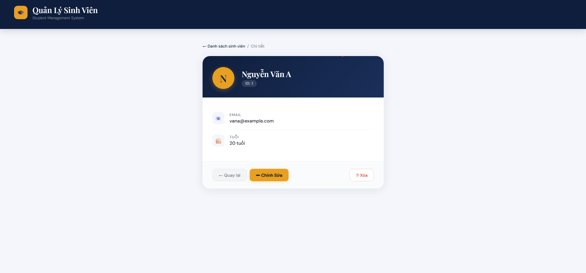
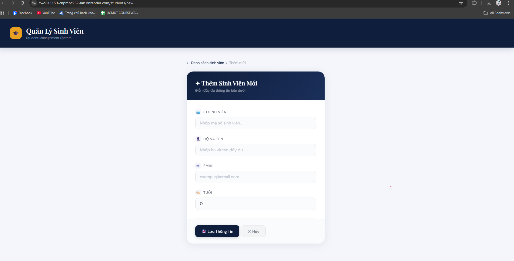

# Student Management System (Hệ thống Quản lý Sinh viên)

> **Môn học:** Công nghệ phần mềm nâng cao (Advanced Software Engineering)
>
> **Trường:** Đại học Bách Khoa TP.HCM (HCMUT)
>
> **Giảng viên hướng dẫn:** Lê Đình Thuận

Ứng dụng mẫu xây dựng bằng **Java Spring Boot** để thực hành CRUD, Server-Side Rendering với Thymeleaf và triển khai.

---

## 🌐 Live Demo
- Web Service: https://two311159-cnpmnc252-lab.onrender.com

---

## 👥 Thành viên nhóm
| STT | Họ và Tên | MSSV | Vai trò |
|:---:|:---|:---|:---|
| 1 | Lê Thanh Huy | 2311159 | Developer |

---

## 🛠 Công nghệ
- Ngôn ngữ: Java 17+
- Framework: Spring Boot 3.x
- Build: Maven (sử dụng `mvnw`)
- Database: SQLite (Lab 1-3), PostgreSQL (Lab 4-5)
- Template: Thymeleaf
- Frontend: HTML5, CSS3
- Deployment: Docker, Render.com

---

## 🚀 Cài đặt & chạy (Local)

### Yêu cầu
- JDK 17+
- Git

### Các bước
1. Clone repo
```bash
git clone https://github.com/Huy1705/hcmut-asw-student-management.git
cd hcmut-asw-student-management
```

2. (Tùy chọn) Cấu hình PostgreSQL cho môi trường Lab 4-5: tạo file `.env` ở gốc dự án với các biến sau:

```
POSTGRES_HOST=localhost
POSTGRES_PORT=5432
POSTGRES_DB=student_management
POSTGRES_USER=postgres
POSTGRES_PASSWORD=your_password_here
```

Lưu ý: không commit file `.env` chứa thông tin nhạy cảm.

3. Chạy ứng dụng
```bash
./mvnw spring-boot:run
```

Mở trình duyệt: http://localhost:8080/students

---

## ☁️ Triển khai (Deployment)
- Dự án có thể chạy trên Render bằng cách kết nối repository và cấu hình các biến môi trường:
	- `DATABASE_URL` (ví dụ: `jdbc:postgresql://<neon-host>/neondb?sslmode=require`)
	- `DB_USERNAME`, `DB_PASSWORD`

Render sẽ nhận diện `Dockerfile` (nếu có) để build và deploy.

---

## 📚 Trả lời câu hỏi lý thuyết (Lab 1)

**Câu 1 — Ràng buộc Khóa Chính (Primary Key)**

Khi cố tình insert một sinh viên có ID đã tồn tại, hệ thống sẽ báo lỗi `UNIQUE constraint failed`. Database chặn thao tác này vì Primary Key yêu cầu mỗi bản ghi phải có định danh duy nhất — điều này đảm bảo tính toàn vẹn và tránh trùng lặp dữ liệu.

**Câu 2 — Toàn vẹn dữ liệu (Constraints)**

Nếu cột `name` không có ràng buộc `NOT NULL`, Database sẽ cho phép giá trị `NULL`. Khi Spring Data JPA đọc dữ liệu, thuộc tính `name` trong Entity sẽ là `null`. Nếu code Java gọi phương thức trên chuỗi này (ví dụ `student.getName().toUpperCase()`), chương trình sẽ ném `NullPointerException` và có thể crash.

**Câu 3 — Cấu hình Hibernate**

Nếu `spring.jpa.hibernate.ddl-auto` đang đặt là `create`, Hibernate sẽ drop và recreate schema mỗi lần khởi động, dẫn đến mất dữ liệu cũ. Ở môi trường production nên dùng `update` hoặc `none` để giữ dữ liệu.

---

## 📸 Screenshots (Kết quả Lab 4 & 5)

```markdown



```


